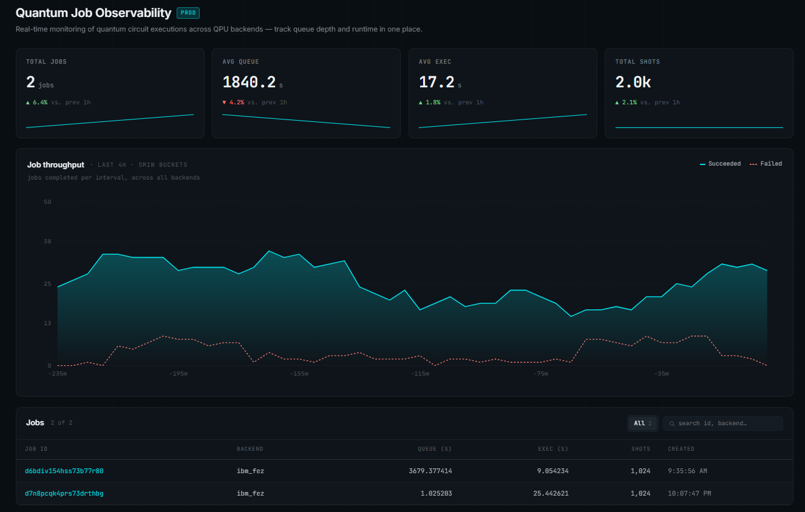

<h1 align="center">
  <br />
  QOBS
  <br />
  <small>Quantum Job Observability System</small>
</h1>

<p align="center">
  <a href="https://www.python.org/downloads/">
    
  </a>
  <a href="https://fastapi.tiangolo.com">
    
  </a>
  <a href="https://react.dev">
    
  </a>
  <a href="https://qiskit.org">
    
  </a>
  <a href="LICENSE">
    
  </a>
</p>

<p align="center">
  <a href="#the-problem"><strong>Problem</strong></a>
  &middot;
  <a href="#features"><strong>Features</strong></a>
  &middot;
  <a href="#architecture"><strong>Architecture</strong></a>
  &middot;
  <a href="#installation"><strong>Installation</strong></a>
  &middot;
  <a href="#api-reference"><strong>API</strong></a>
  &middot;
  <a href="#roadmap"><strong>Roadmap</strong></a>
</p>

Open-source observability tool for quantum researchers that collects IBM Quantum job executions and surfaces the metrics the official dashboard does not show — queue time history, execution time trends, and the data you need to know when to submit.

<p align="center">
  
</p>

---

## The problem

IBM Quantum's cloud dashboard tells you whether a job completed. It does not tell you how long your job sat in queue before the device touched it, how execution time has drifted across submissions, or whether Monday at 9 AM is consistently slower than Wednesday at 2 AM. Without that data, every job submission is a guess.

QOBS solves this by recording every metric your Qiskit runtime returns — queue time, execution time, shot count, backend, and timestamp — and making the full history queryable through a REST API and a live dashboard built for researchers, not cloud product managers.

```python
import requests
from qiskit_ibm_runtime import SamplerV2 as Sampler

sampler = Sampler(backend)
job = sampler.run([circuit], shots=1024)
job.wait_for_final_state()

requests.post("http://localhost:8000/jobs", json={"job_id": job.job_id()})
```

Your queue times, execution times, and submission history are now permanent, searchable, and visible in the dashboard.

---

## Features

**Queue time tracking.**
Records the gap between job submission and device pickup for every run — the metric IBM Quantum does not persist or expose historically. Over time this becomes a dataset that shows you exactly when a backend is under pressure.

**Execution time trends.**
Tracks how long the QPU actually ran your circuit, separate from queue overhead, so you can distinguish hardware variability from scheduling variability. Critical for benchmarking circuit depth against real device performance.

**Live observability dashboard.**
React frontend with a sticky live/paused toggle, metric summary cards, a job throughput chart, and a full searchable job history table — all updating in real time from the local API.

**Metric cards with sparklines.**
At-a-glance view of total jobs collected, average queue time, average execution time, and total shots fired, each with a trend sparkline built from actual job data.

**Searchable job table.**
Every collected job is stored permanently and displayed in a sortable, searchable table with backend, queue time, execution time, shot count, and submission timestamp. Queue and execution times are shown in human-readable form (`25s`, `3m 12s`, `1h 4m`). Job IDs are truncated in the table with the full ID visible on hover. Deletions require an inline confirmation step to prevent accidental removal.

**Backend comparison.**
The Backends page aggregates all stored jobs by device and shows each backend's total job count, average queue time, and average execution time as metric cards — giving a quick cross-device performance overview.

**Circuit tracking.**
The collector extracts `num_qubits` and `circuit_depth` from every submitted circuit and persists them alongside the job. The Circuits page surfaces this data in a searchable table, making it easy to correlate circuit complexity with queue and execution time. If a job already exists in the database without circuit metadata, re-posting its ID will fetch the circuit data from IBM and update the record without duplicating or overwriting any other fields.

**REST API.**
Clean FastAPI endpoints expose your full job history as JSON, so you can query it from notebooks, scripts, or any other tool without touching the dashboard.

**Local-first, zero lock-in.**
Everything runs on your machine. Data lives in a single SQLite file. No cloud services, no third-party accounts, no telemetry — only the IBM Quantum credentials you already have.

---

## Architecture

```
qobs/
├── api/
│   └── main.py          # FastAPI app — endpoints, CORS, Pydantic response models
├── collector/
│   ├── job_runner.py    # Fetches completed job metrics from IBM Quantum via Qiskit
│   └── run_circuit.py   # Submits circuits to IBM backends and records job IDs
├── storage/
│   ├── database.py      # SQLAlchemy ORM model (QuantumJob) and SQLite engine
│   └── query.py         # Query helpers
├── dashboard/           # React + Vite frontend
│   └── src/
│       └── App.jsx      # Metric cards, throughput chart, jobs table
└── quantum_jobs.db      # SQLite database — created automatically on first run
```

**Data flow:**

```
IBM Quantum backend
       │
       │  Qiskit IBM Runtime
       ▼
collector/run_circuit.py   ──►  collector/job_runner.py
                                        │
                                        │  SQLAlchemy
                                        ▼
                                  quantum_jobs.db (SQLite)
                                        │
                                        │  FastAPI
                                        ▼
                                  api/main.py  :8000
                                        │
                                        │  axios / HTTP
                                        ▼
                              dashboard (React)  :5173
```

**Data model — `quantum_jobs` table:**

| Column | Type | Description |
|---|---|---|
| `id` | TEXT | IBM Quantum job ID, e.g. `crv6x9zy7k2000089g0g` |
| `backend` | TEXT | Device name, e.g. `ibm_fez` |
| `queue_time` | REAL | Seconds between submission and execution start |
| `execution_time` | REAL | Seconds the QPU spent running the circuit |
| `shots` | INTEGER | Number of measurement shots |
| `created_at` | DATETIME | Job creation timestamp (UTC) |
| `num_qubits` | INTEGER | Number of qubits in the submitted circuit (nullable) |
| `circuit_depth` | INTEGER | Transpiled circuit depth (nullable) |

---

## Installation

### Requirements

- Python 3.10 or later
- Node.js 18 or later
- An [IBM Quantum](https://quantum.ibm.com) account with an API token

---

### 1. Clone the repository

```bash
git clone https://github.com/danisotosol/qobs.git
cd qobs
```

### 2. Set up the Python environment

```bash
python -m venv venv
source venv/bin/activate        # Windows: venv\Scripts\activate

pip install fastapi uvicorn sqlalchemy qiskit qiskit-ibm-runtime python-dotenv
```

### 3. Configure your IBM Quantum credentials

Create a `.env` file in the project root with your IBM Quantum API token:

```
IBM_TOKEN=your_api_token_here
```

The project uses `python-dotenv` to load this automatically. Never commit `.env` to version control — it is already listed in `.gitignore`.

### 4. Initialize the database and start the API

```bash
python -c "from storage.database import init_db; init_db()"
uvicorn api.main:app --reload
```

The API starts at `http://localhost:8000`. Interactive docs at `http://localhost:8000/docs`.

### 5. Start the dashboard

Open a second terminal:

```bash
cd dashboard
npm install
npm run dev
```

The dashboard opens at `http://localhost:5173`.

---

## API reference

| Method | Endpoint | Description |
|---|---|---|
| `GET` | `/jobs` | Return all collected jobs |
| `GET` | `/jobs/{job_id}` | Return a single job by IBM job ID |
| `POST` | `/jobs` | Fetch a job from IBM Quantum and store it |
| `DELETE` | `/jobs/{job_id}` | Delete a job from the database |
| `GET` | `/backends` | Return aggregated stats per backend |
| `GET` | `/circuits` | Return all jobs with circuit metadata |
| `GET` | `/metrics/throughput` | Return hourly job counts for the throughput chart |

**POST `/jobs` — request body:**

```json
{ "job_id": "crv6x9zy7k2000089g0g" }
```

**Example response:**

```json
{
  "id": "crv6x9zy7k2000089g0g",
  "backend": "ibm_fez",
  "queue_time": 47.3,
  "execution_time": 2.8,
  "shots": 4096,
  "created_at": "2025-04-26T14:22:01"
}
```

---

## Collecting jobs

**From the command line:**

```bash
curl -X POST http://localhost:8000/jobs \
  -H "Content-Type: application/json" \
  -d '{"job_id": "your-ibm-job-id"}'
```

**From a Python script after running a circuit:**

```python
import requests
from qiskit_ibm_runtime import QiskitRuntimeService, SamplerV2

service = QiskitRuntimeService()
backend = service.least_busy(operational=True, simulator=False)

job = SamplerV2(backend).run([circuit], shots=1024)
job.wait_for_final_state()

requests.post("http://localhost:8000/jobs", json={"job_id": job.job_id()})
```

Run this after every experiment session and QOBS builds up a longitudinal record of your backend's behaviour over time.

**Backfilling circuit metadata for existing jobs:**

If you collected jobs before circuit tracking was added, re-post each job ID and the collector will fetch `num_qubits` and `circuit_depth` from IBM and patch the existing record:

```bash
curl -X POST http://localhost:8000/jobs \
  -H "Content-Type: application/json" \
  -d '{"job_id": "your-existing-job-id"}'
```

No data is lost — only the two circuit columns are updated.

---

## Roadmap

**Real throughput chart.**
The dashboard currently shows a simulated throughput curve. The immediate next step is a `/metrics/throughput` endpoint that buckets actual stored job counts into five-minute windows, giving the chart real data and making backend congestion visible over a rolling four-hour window.

**Job status tracking.**
Extend the data model to record job status (`queued`, `running`, `completed`, `failed`) at collection time, and add status-based filter tabs to the dashboard table.

**Best time to submit.**
Aggregate queue time by hour-of-day and day-of-week across all stored jobs to surface submission windows where a given backend is consistently fastest. This is the core research insight QOBS is built toward — turning anecdotal experience into a data-driven submission strategy.

**Backend comparison view.**
Side-by-side queue time and execution time distributions across IBM backends, so researchers can make evidence-based decisions about which device to target for a given circuit depth.

**Fidelity tracking.**
Pull measurement fidelity from completed job results and add a per-job fidelity bar and aggregate fidelity trend card to the dashboard.

**Automated collection.**
A background scheduler that polls IBM Quantum at a configurable interval for newly completed jobs, removing the need to POST job IDs manually after every session.

**Multi-provider support.**
Extend the collector beyond IBM Quantum to support IonQ and Quantinuum backends via their respective Qiskit-compatible SDKs, using the same shared job schema and dashboard.

---

## Contributing

Bug reports, feature requests, and pull requests are welcome. Please open an issue before starting significant work so the approach can be discussed first.

---

## License

MIT
